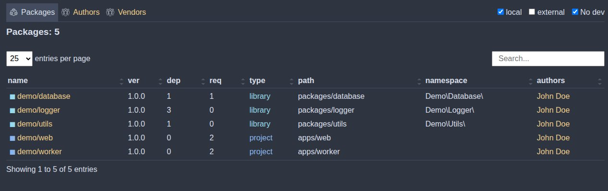
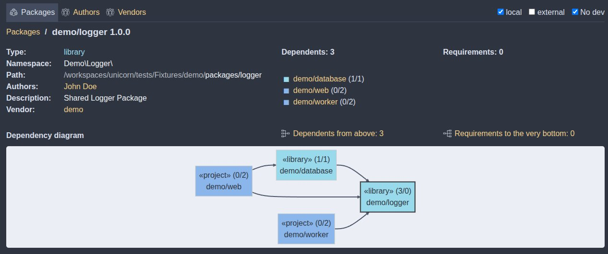

# Commands Reference

All Unicorn commands are prefixed with `uni:` and can be executed via the standard `composer` CLI.

> **Tip**: You can use the standard Composer `-d` or `--working-dir` option with any command to specify the working directory without needing to `cd` into it (e.g., `composer uni:run test -d packages/logger`). This is especially useful for automation scripts.

---

### `composer uni:install [options] [--] [<packages>...]`
Initializes or restores the monorepo dependencies.
- If called without parameters and the global `vendor` directory does not exist, it installs all dependencies for the entire monorepo.
- If the global `vendor` directory exists, it verifies the consistency of package requirements against `composer.lock`.
- If a list of local packages is provided, it behaves like running `composer install` inside each of those packages.

> **Note**: If any of the local packages in your monorepo contains an invalid `composer.json` file (e.g., syntax errors, missing name, or invalid version constraints), the plugin might fail to initialize entirely, and Composer will output:
> `There are no commands defined in the "uni" namespace.`
> If you encounter this error, run `composer uni:doctor` to diagnose the state of your monorepo and pinpoint the invalid configurations.

---

### `composer uni:update <packages>...`
Updates the specified packages across all dependents in the monorepo.
- Supports changing constraints on the fly: e.g., `composer uni:update "foo/bar:^1.0"` or `composer uni:update foo/bar=^1.0`.
- Edits `composer.json` files safely (reverts them if the update fails).
- Executes scripts defined in `post-update-scripts` (in the root `composer.json`) after a successful update.

---

### `composer uni:run [options] [--] [<script>...]`
Recursively resolves the dependency tree and executes the given script for all packages that depend on the current package. Essential for Smart CI pipelines.
- **Options:**
  - `-s, --self`: Also run the script for the current package.
  - `-r, --recursive`: Recursively resolve dependencies all the way up to the root applications.
  - `-a, --all`: Run the script for *all* local packages in the monorepo.
  - `-l, --list`: List all available scripts.

---

### `composer uni:build <package> <directory>`
Prepares a package for production deployment.
- Copies all required packages (both third-party and local) into the specified `<directory>` instead of symlinking them.
- You can pass additional install flags (like `--no-dev --optimize-autoloader`) via the `build-install-options` config in the root `composer.json`.

---

### `composer uni:split`
Splits local monorepo packages into their own independent remote Git repositories.
- Essential for mirroring packages to read-only repositories (like `github.com/my-org/logger`).
- Automatically handles Git history extraction and tag pushing.
- For a full setup guide, see [Monorepo Split](04-monorepo-split.md).

---

### `composer uni:doctor`
Diagnoses the state of the monorepo and detects configuration issues.
- Validates the root `composer.json` configuration.
- Checks all local package directories for valid `composer.json` files and proper placement.
- Verifies if the monorepo is initialized properly.
- Scans for orphaned dependencies (local packages that are not required by any other package).

---

### `composer uni:server`
Spins up a local HTTP web server (default port `8067`) to visually explore the monorepo's dependency graph. Uses Mermaid JS to render interactive architectural diagrams. You can customize the port by setting the `UNI_SERVER_PORT` environment variable.

The server allows analyzing package dependencies and provides two main views depending on where the command is executed:

#### 1. Package List View (running outside a package)
When the server is launched from the root or outside a specific package directory, it displays a comprehensive package list:

- Includes **sorting and search** capabilities.
- By default, **third-party and dev-dependencies are hidden** to keep the list clean.
- A **filter in the top right corner** allows you to customize which packages are displayed.

#### 2. Package Details View (running inside a local package)
When the server is launched from within a local package directory, it focuses on that specific package:

- Displays **author information**.
- Lists **dependents** (packages that depend on the current one).
- Lists **requirements** (packages the current package depends on).
- Features an **interactive diagram** at the bottom for navigating between packages.

The interactive diagram shows only *direct* dependencies by default. For deeper analysis, you can click the following links:
- **Dependents from above**: Renders a full dependency tree from the top down to the target package.
- **Requirements to the very**: Renders a diagram of all dependencies all the way down from the target package.

---

### `composer uni:version [ major | minor | patch ]`
Bumps the version of the current package and automatically updates the requirement constraint in all packages that depend on it.

This command will:
1. Bump the version inside the target package's `composer.json`.
2. Find all packages in the monorepo whose constraints for the target package no longer match the new version.
3. Automatically update their `require` statements to match the new version (e.g., to `"^2.0"`).
4. Perform a test installation to ensure the monorepo remains stable.
5. Execute any scripts defined in `post-update-scripts` for the affected packages.
6. Automatically roll back all version changes if any installation or script execution errors occur.

---

### `composer uni:why <package>`
Shows which packages in the monorepo cause the given package to be installed (upstream dependents).

---

### `composer uni:why-not <package>`
Shows which packages prevent the given package from being installed or updated to a specific version due to conflicts.

---

### `composer uni:show`
Displays detailed information about the installed packages in the monorepo.

---

### `composer uni:namespace`
Suggests package namespaces based on a given pattern.
